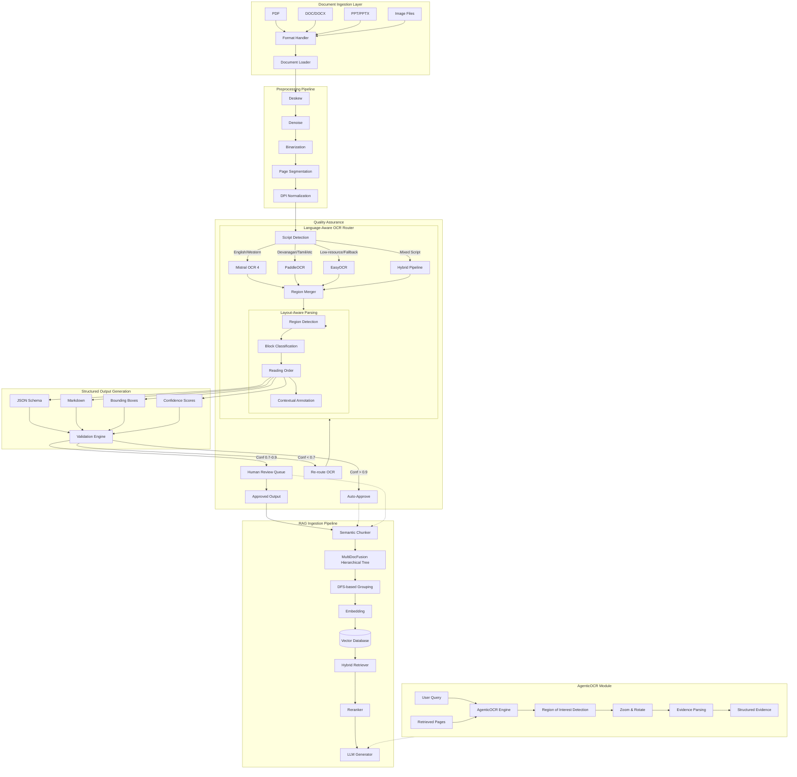
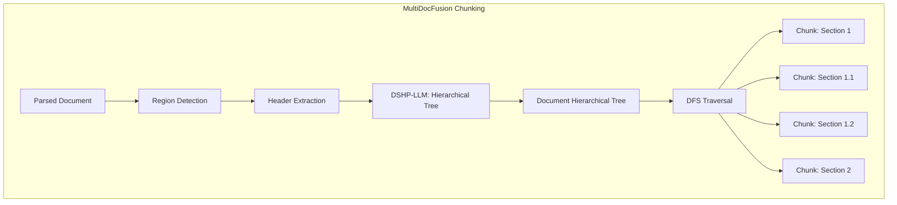
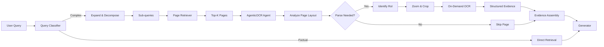
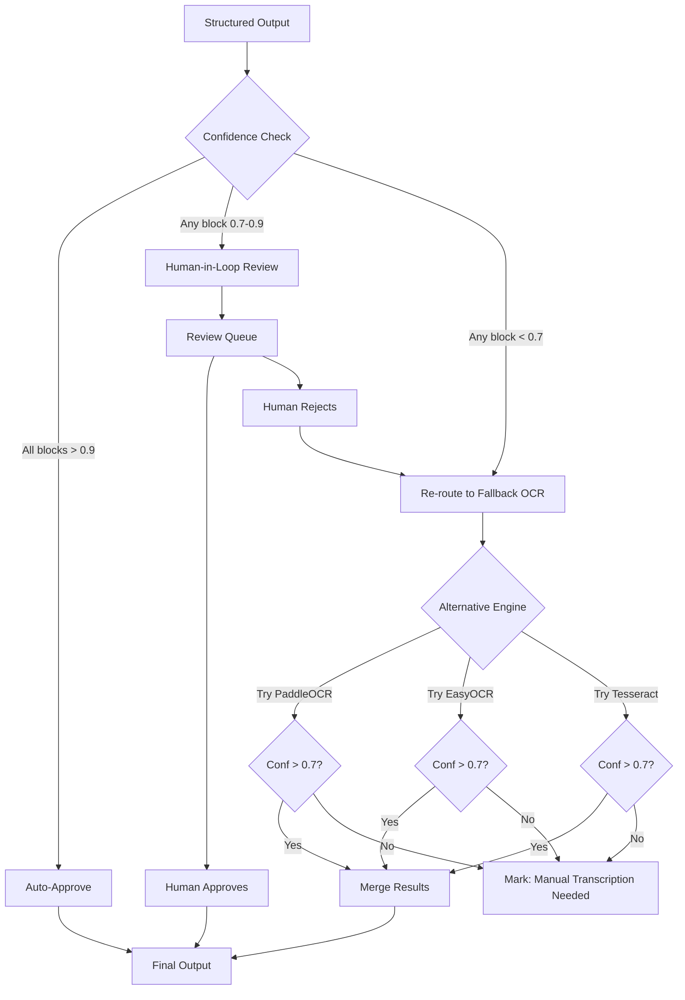

# Multi-Language Document Intelligence Pipeline — Architecture

## 1. Executive Summary

A production-grade, layout-aware document intelligence pipeline supporting 13+ languages (12 Indian + English), designed as the ingestion foundation for enterprise RAG systems. Incorporates AgenticOCR-style query-driven parsing, MultiDocFusion hierarchical chunking, and the InduOCRBench finding that high OCR accuracy does not guarantee strong RAG performance. Three OCR engines are orchestrated via a language-aware model router: Mistral OCR 4 (primary, high-quality), PaddleOCR (Indian languages), EasyOCR (fallback).

## 2. High-Level Pipeline Architecture



## 3. Document Ingestion Layer

### Format Handling Matrix

| Format | Strategy | Fallback | Notes |
|--------|----------|----------|-------|
| PDF (digital) | Native text extraction + layout overlay | PDF-to-image conversion | PyMuPDF for text, pdfplumber for tables |
| PDF (scanned) | Image-based pipeline | Tesseract | Auto-detect via font embedding check |
| DOC/DOCX | python-docx → Markdown | LibreOffice conversion | Preserve styles, headers, footers |
| PPT/PPTX | python-pptx → slide images | LibreOffice | Each slide treated as page image |
| PNG/JPEG/TIFF | Direct image → OCR pipeline | — | Auto-orientation EXIF handling |
| HTML | BeautifulSoup → structured text | Playwright rendering | JS-rendered content fallback |

### Ingestion Preprocessing

```
Raw Document → MIME Detection → Format Router → 
  [PDF: Font check (digital vs scanned)] → 
  [Image: EXIF orientation → deskew → denoise → binarize] →
  Page-wise extraction → Metadata envelope
```

**Metadata Envelope** (per page):
```json
{
  "doc_id": "uuid",
  "page_num": 1,
  "total_pages": 12,
  "format": "pdf_scanned",
  "dpi": 300,
  "dimensions": {"width": 2480, "height": 3508},
  "hash": "sha256",
  "source": "s3://bucket/doc.pdf",
  "ingestion_timestamp": "2026-07-15T12:00:00Z"
}
```

## 4. OCR Engine Selection Strategy

### Engine Capability Matrix

| Feature | Mistral OCR 4 | PaddleOCR (v3.5) | EasyOCR | Tesseract 5 |
|---------|--------------|------------------|---------|-------------|
| Languages | 170 (10 groups) | 109 | 80+ | 100+ |
| Indic Scripts | Hindi, Bengali, Gujarati, Tamil, Malayalam, Kannada, Telugu, Urdu | Devanagari, Tamil, Telugu, Bengali, Gurumukhi, Kannada, Malayalam, Oriya | Hindi, Tamil, Bengali, Telugu | Devanagari, Tamil, Telugu, Kannada, Malayalam |
| Block Classification | Native (13 types) | PP-StructureV3 | None | None |
| Bounding Boxes | Per-block + per-word | Per character | Per word | Per word |
| Confidence Scores | Per-word + per-page | Per character | Per word | Per character |
| Self-Hosted | Single container (enterprise) | Docker + ONNX/CUDA | Docker | Native |
| Cost | $2-5/1k pages | Free (MIT) | Free (Apache 2.0) | Free (Apache 2.0) |
| OmniDocBench | 93.07 | 92.9 (PaddleOCR-VL) | — | — |
| Strength | SOTA structured output, layout-aware | Best Indic script accuracy | Quick prototyping | Legacy fallback |

### Model Routing Decision Tree

```mermaid
flowchart TD
    A[Detect Page Script] --> B{Primary Script?}
    B -->|English, French, German, etc| C[Confidence > 0.95?]
    C -->|Yes| D[Mistral OCR 4]
    C -->|No| E[Route to region-specific]
    B -->|Devanagari| F{Is layout complex?}
    F -->|Yes (multi-col, tables)| G[PaddleOCR-VL]
    F -->|No (simple text)| H[PaddleOCR]
    B -->|Tamil / Telugu / Kannada| I[PaddleOCR (specialized model)]
    B -->|Bengali / Assamese| J[PaddleOCR Bengali model]
    B -->|Gujarati| K[PaddleOCR / EasyOCR fusion]
    B -->|Malayalam| L[PaddleOCR Malayalam model]
    B -->|Punjabi / Oriya| M[EasyOCR fallback]
    B -->|Mixed Script (Eng + Indic)| N[Hybrid: Mistral OCR 4 + PaddleOCR]
    N --> O[Region-level merge by script]
    G --> O
    D --> P[Output: blocks + bboxes + conf]
    H --> P
    I --> P
    J --> P
    K --> P
    L --> P
    M --> P
    O --> P
```

### Hybrid Fusion Strategy

For documents with mixed scripts (e.g., English + Hindi in same document):

1. Run both Mistral OCR 4 and PaddleOCR on the same page
2. Align results by bounding box overlap (IoU > 0.5 = same region)
3. For each region, select OCR result with higher confidence
4. If both engines score low (< 0.7), route to EasyOCR for tiebreak
5. Final output: merged blocks with per-region engine attribution

```json
{
  "region_id": "r_0017",
  "block_type": "text",
  "bbox": {"x1": 0.12, "y1": 0.34, "x2": 0.85, "y2": 0.38},
  "text": "अनुच्छेद 370 के तहत विशेष दर्जा",
  "confidence": 0.94,
  "engine": "paddleocr",
  "script": "devanagari"
}
```

## 5. Multi-Language Support Design

### Supported Languages (13+)

| Language | Script | Primary Engine | Fallback | Notes |
|----------|--------|---------------|----------|-------|
| English | Latin | Mistral OCR 4 | Tesseract 5 | Baseline |
| Hindi | Devanagari | PaddleOCR | EasyOCR | Most common Indic |
| Bengali | Bengali | PaddleOCR | EasyOCR | Shared script with Assamese |
| Tamil | Tamil | PaddleOCR | EasyOCR | Dravidian group |
| Telugu | Telugu | PaddleOCR | EasyOCR | Dravidian group |
| Kannada | Kannada | PaddleOCR | EasyOCR | Dravidian group |
| Malayalam | Malayalam | PaddleOCR | Mistral OCR 4 | Mistral has Malayalam |
| Gujarati | Gujarati | Mistral OCR 4 | PaddleOCR | Both engines strong |
| Marathi | Devanagari | PaddleOCR | EasyOCR | Same script as Hindi |
| Punjabi | Gurumukhi | EasyOCR | Tesseract 5 | Limited engine support |
| Oriya | Oriya | EasyOCR | Tesseract 5 | Low-resource |
| Assamese | Bengali | PaddleOCR | EasyOCR | Reuses Bengali model |
| Urdu | Perso-Arabic | Mistral OCR 4 | EasyOCR | Nastaliq script |

### Script Detection Module

```python
class ScriptDetector:
    """
    UniHD (Universal Hierarchical Detection):
    1. Global page analysis → primary script family
    2. Per-region fine classification → specific language
    3. Confidence-weighted voting for mixed pages
    """
    def detect_scripts(self, page_image, regions):
        for region in regions:
            # CNN-based script identification
            script_probs = self.model.predict(region.crop)
            dominant = argmax(script_probs)
            # If mixed, store top-3 candidates
            region.scripts = sorted(script_probs, key=lambda x: x[1], reverse=True)[:3]
```

## 6. Layout-Aware Parsing

### Block Classification Schema (Mistral OCR 4 compatible)

| Block Type | Description | Handling Strategy | RAG Relevance |
|-----------|-------------|-------------------|---------------|
| title | Document/section title | High priority, used for chunk hierarchy | Critical (chunk anchor) |
| text | Paragraph text | Direct extraction, semantic chunking | Primary retrieval unit |
| table | Tabular data | Structured extraction (Markdown/HTML) | High (structured data) |
| figure | Image/diagram | Caption extraction, VLM description | Moderate (visual context) |
| equation | Mathematical formula | LaTeX generation via formula decoder | High (technical docs) |
| list | Bulleted/numbered list | Preserve structure, indent hierarchy | Moderate |
| caption | Figure/table caption | Attach to parent figure/table | High (context anchor) |
| header | Running header | Detect and strip from chunk content | Negative (noise) |
| footer | Page footer | Detect and strip (except page numbers) | Negative (noise) |
| signature | Handwritten/digital signature | Isolate, flag for verification | High (compliance) |
| code | Code blocks | Preserve indentation, language detection | High (technical) |
| references | Citations/bibliography | Preserve as-is, linked to in-text cites | Moderate |
| aside_text | Sidebar/margin notes | Preserve separately, treat as supplement | Low (auxiliary) |

### Region Detection Pipeline

```
Page Image → RT-DETR/ObjectDetector → Flat Region List →
Geometric Containment Engine → Hierarchical Tree (Parent-Child) →
Reading Order Reconstructor (top-to-bottom, left-to-right, multi-col aware) →
Contextual Annotation
```

### Reading Order Reconstruction

For multi-column documents and complex layouts:

```
1. Sort blocks by y-coordinate (vertical bands)
2. Within each band, sort by x-coordinate
3. Detect column gaps via whitespace histogram
4. Assign column IDs to blocks
5. Process columns left-to-right, top-to-bottom
6. Cross-column continuations: if text continues from col1 to col2,
   interpolate based on semantic similarity
```

## 7. Structured Output Generation

### JSON Schema (Core Document Object)

```json
{
  "document": {
    "doc_id": "uuid",
    "metadata": {
      "format": "pdf",
      "total_pages": 12,
      "languages_detected": ["english", "hindi"],
      "processing_pipeline": "mistral_ocr_4:paddleocr_v3.5",
      "timestamp": "2026-07-15T12:00:00Z"
    },
    "pages": [
      {
        "page_num": 1,
        "dimensions": {"width": 2480, "height": 3508, "dpi": 300},
        "page_confidence": 0.97,
        "markdown": "# Title\n\nContent in Markdown...",
        "blocks": [
          {
            "block_id": "b_0001",
            "type": "title",
            "bbox": {"x1": 0.1, "y1": 0.05, "x2": 0.9, "y2": 0.12},
            "text": "Annual Financial Report 2025",
            "confidence": 0.99,
            "engine": "mistral_ocr_4",
            "script": "latin"
          },
          {
            "block_id": "b_0002",
            "type": "table",
            "bbox": {"x1": 0.05, "y1": 0.2, "x2": 0.95, "y2": 0.55},
            "text": "| Quarter | Revenue | Growth |\n|---------|---------|--------|\n| Q1 | $1.2M | 12% |\n| Q2 | $1.5M | 25% |",
            "markdown_table": true,
            "confidence": 0.93,
            "word_confidences": [
              {"word": "Quarter", "conf": 0.99},
              {"word": "Revenue", "conf": 0.98}
            ]
          }
        ],
        "images": [
          {
            "image_id": "img_001",
            "bbox": {"x1": 0.6, "y1": 0.6, "x2": 0.95, "y2": 0.85},
            "caption": "Revenue growth chart for FY 2025",
            "vlm_description": "A bar chart showing quarterly revenue...",
            "confidence": 0.88
          }
        ]
      }
    ]
  }
}
```

### Output Format Converters

| Format | Use Case | Converter |
|--------|----------|-----------|
| Markdown | Human reading, simple RAG | Direct page markdown |
| JSON | Machine processing, API consumption | Full schema above |
| CSV | Table extraction, spreadsheets | Tables → CSV |
| Parquet | Large-scale analytics, columnar storage | Nested JSON → Parquet |
| HTML | Web display, search previews | Markdown → HTML + bbox overlay |

## 8. RAG Integration Design

### Semantic Chunking Strategy (MultiDocFusion-inspired)



**Chunking Rules:**

1. **Structure-first**: Split along document's natural divisions (sections, subsections)
2. **Table atomicity**: Tables within 5KB remain single chunks; larger tables are split by row with repeated headers
3. **Figure-caption pairing**: Figures + captions always travel together
4. **Hierarchical metadata**: Each chunk carries its full section path as metadata
5. **Token budget**: Soft ceiling of 1024 tokens per chunk; hard ceiling of 2048
6. **Overlap**: 64-token overlap on section boundaries for continuity
7. **Noise stripping**: Headers, footers, page numbers removed before chunking
8. **Context enrichment**: Per-chunk situational context prepended (document name, section path)

### Chunk Metadata Schema

```json
{
  "chunk_id": "chunk_a1b2c3",
  "doc_id": "doc_uuid",
  "content": "Section text content...",
  "metadata": {
    "section_path": "3. Financial Results > 3.1 Revenue",
    "page_range": [5, 7],
    "block_types": ["title", "text", "table"],
    "language": "english",
    "has_tables": true,
    "has_formulas": false,
    "chunk_token_count": 856,
    "embedding_model": "multilingual-e5-large"
  }
}
```

### Embedding and Indexing

```
Chunks → Multilingual Embedding Model (e5-mistral, bge-m3) →
  Dual Index: Dense (FAISS/Pinecone) + Sparse (BM25) →
  Reciprocal Rank Fusion at query time →
  Metadata filter (doc_id, language, section_path)
```

### Hybrid Retrieval

```
Query → Query Expansion (3 variations) → Dense Search → BM25 Search →
RRF Fusion → LLM Re-ranker → Top-K Chunks → Generator
```

## 9. AgenticOCR-Inspired On-Demand Parsing

### Query-Driven Region Extraction Flow



### AgenticOCR Module Architecture

```
AgenticOCR-4B/8B (Qwen3-VL based) → 
  image_zoom_and_ocr_tool:
    - Region mode (τ=region): full layout analysis on zoomed region
    - Element mode (τ∈{text,table,equation}): direct element parsing
    - Image mode (τ=image): visual-only (no OCR)
  Training: SFT (trajectory distillation) → GRPO RL (sparsity reward)
```

### Integration with Static Pipeline

```
Pipeline Mode (default): Parse everything → Chunk → Embed → Index
AgenticOCR Mode (on-demand): Query → Retrieve pages → Parse only relevant regions → Generate answer
```

The system auto-selects mode based on:
- **Batch ingestion**: Use full pipeline mode (comprehensive indexing)
- **Real-time Q&A**: Use AgenticOCR mode (token-efficient, precise)
- **Hybrid**: Full pipeline for document corpus, AgenticOCR for complex queries on retrieved pages

## 10. Quality Assurance Pipeline

### Confidence-Gated Validation



### QA Metrics Tracked

| Metric | Threshold | Action |
|--------|-----------|--------|
| Per-word confidence | > 0.9 | Pass through |
| Per-page confidence | > 0.85 | Pass through |
| Block type consistency | Match layout model | If mismatch, re-classify |
| Reading order coherence | No gaps/jumps | If broken, re-sort by coordinates |
| Table structural integrity | Rows × Cols match | If fragmented, re-extract |
| Language consistency per block | 90% same script | If mixed, flag for human |
| Entity preservation | No dropped numbers/names | If dropped, re-route |

### Human-in-the-Loop (HITL) Review Interface Spec

```
Review Queue → per-item:
  - Side-by-side: Original document crop + OCR output
  - Block-level confidence heatmap overlay
  - Quick actions: Approve / Edit / Reject & Re-route
  - Batch approve for similar confidence patterns
  - Escalation path for persistently low-quality segments
```

## 11. Addressing the InduOCRBench Gap

### The Problem

InduOCRBench finding: VisualStyle documents achieve 82.9% OCR accuracy but only 52.8% RAG accuracy — a 30.1-point gap. OCR strips visual formatting cues (strikethroughs, color emphasis) that encode critical semantics.

### Our Mitigations

| Mitigation | Component | How |
|-----------|-----------|-----|
| Visual semantics preservation | Block classification | Preserve `text_decorated` type with style annotations (bold, italic, strikethrough, color) |
| Hierarchical structure retention | MultiDocFusion DSHP-LLM | Reconstruct section hierarchy before chunking, not after |
| Cross-page table merging | Layout analyzer | Merge table fragments across page boundaries via header matching |
| Multi-column reading order | Reading order reconstructor | Whitespace histogram analysis before text extraction |
| VisualStyle handling | AgenticOCR | For formatted documents, use AgenticOCR's image mode — pass visual patches to generator alongside OCR text |
| Structural integrity scoring | QA pipeline | Dedicated `structural_similarity` metric that penalizes lost formatting |
| RAG-specific QC | Validation engine | Evaluate chunk quality via retrieval precision on hold-out queries before production index |
| Confidence-heatmap routing | OCR router | Route low-confidence layout regions to VLM description step for semantic enrichment |

### Architecture-Level Changes from InduOCRBench Insights

```
Standard OCR-first RAG:   PDF → OCR → Text → Chunk → Embed → Retrieve → Generate
Our intelligent pipeline:  PDF → Layout Analysis → Block Classification → 
                           Style-Preserving OCR → Hierarchical Tree → 
                           DFS Chunking → Embed → Retrieve → 
                           [AgenticOCR for complex queries] → Generate
```

Key differences:
1. OCR is NOT the first step — layout analysis precedes it
2. Structure is explicitly preserved, not implicitly hoped for
3. Visual semantics (style, color, strikethrough) are extracted and preserved as block-level metadata
4. Chunking is structure-aware, not token-count-aware
5. AgenticOCR serves as a safety valve for visually complex documents
