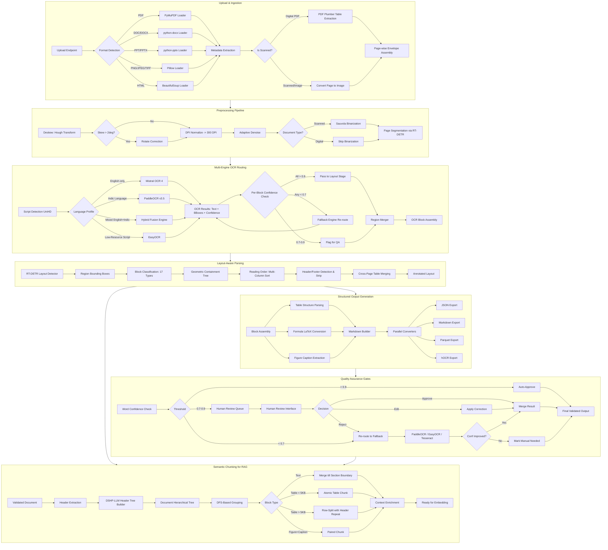
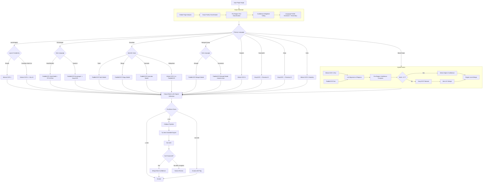
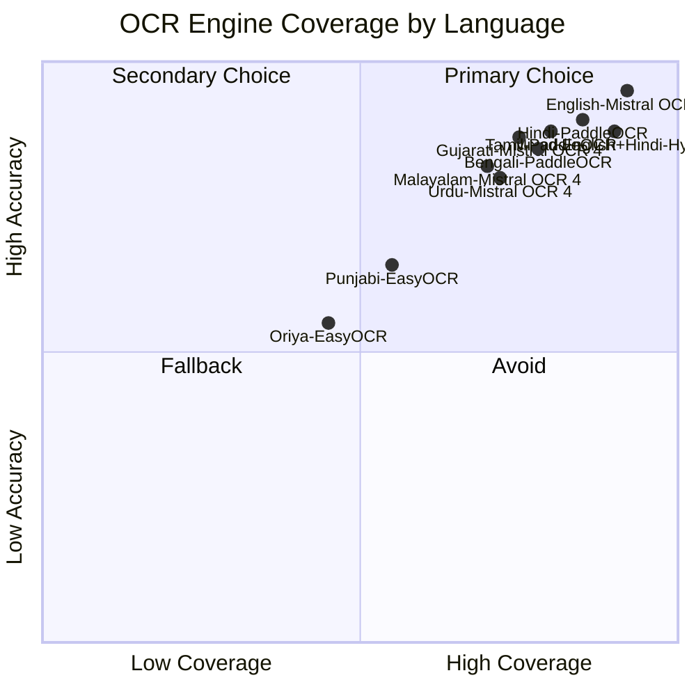
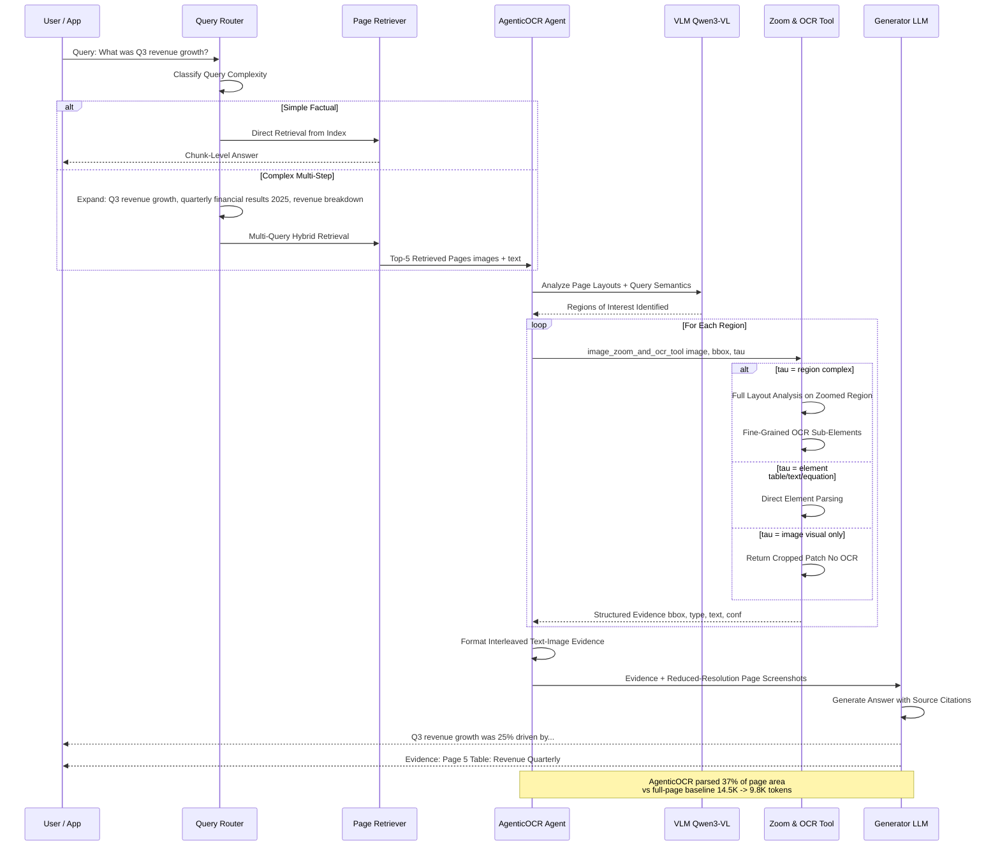
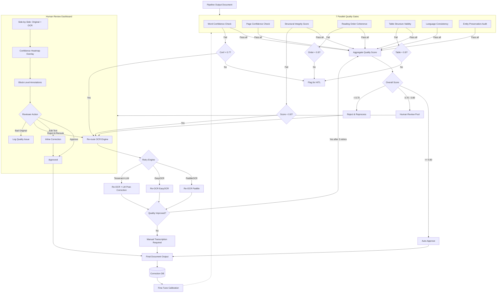
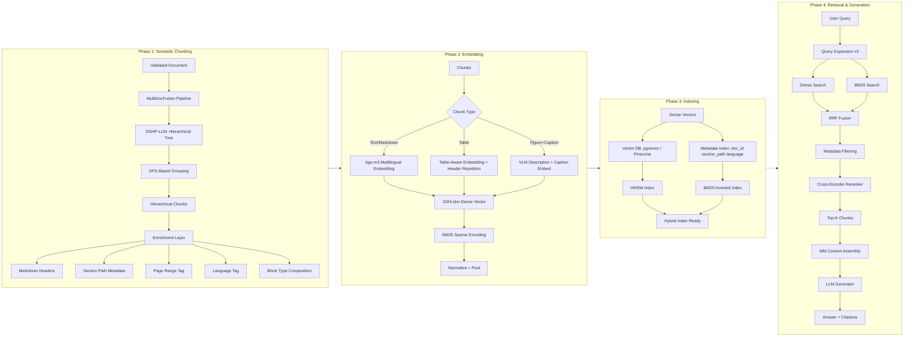
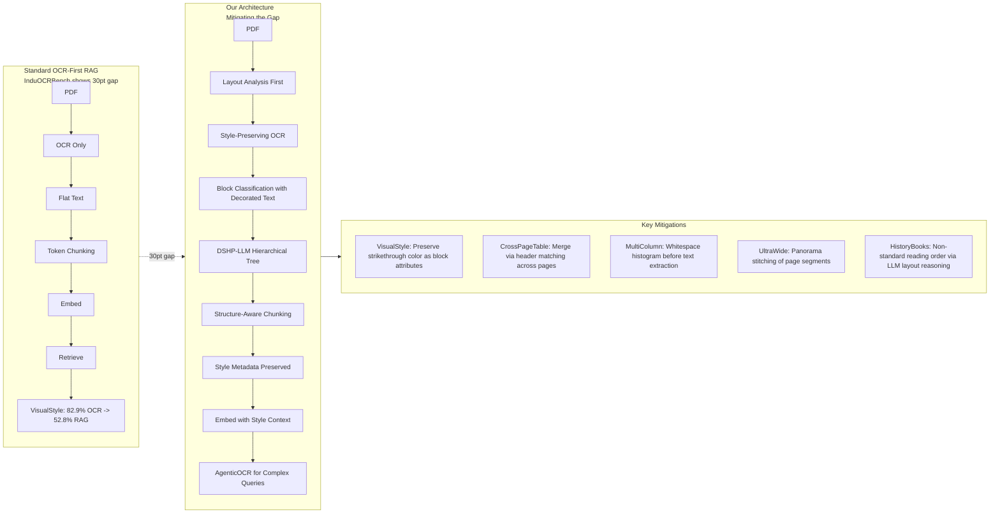

# Multi-Language Document Intelligence Pipeline — Flows

## 1. Document Processing Pipeline (Upload → Validate → Output)



## 2. Language-Aware Model Routing Flow



### Coverage Heatmap



## 3. AgenticOCR Query-Driven Extraction Flow



### AgenticOCR Integration Protocol

```python
class AgenticOCRMiddleware:
    def __init__(self, model_path: str):
        self.agent = AgenticOCRModel(model_path)
        self.tool = ImageZoomAndOCRTool()
    
    async def process(self, query: str, pages: list) -> AgenticOutput:
        evidence = []
        tokens_saved = 0
        
        for page in pages:
            decision = await self.agent.analyze(page, query)
            if not decision.needs_parsing:
                tokens_saved += page.estimated_tokens
                continue
            
            for region in decision.regions_of_interest:
                mode = self._select_mode(region.type)
                result = await self.tool.execute(
                    image=page.image, bbox=region.bbox, mode=mode
                )
                evidence.append(result)
                tokens_saved += region.area_ratio * page.estimated_tokens
        
        assembled = self._assemble(evidence, pages)
        return AgenticOutput(
            query=query, evidence=assembled,
            tokens_used=sum(e.tokens for e in assembled),
            tokens_saved=tokens_saved
        )
    
    def _select_mode(self, region_type: str) -> str:
        return {"table": "element", "equation": "element",
                "figure": "image", "text": "region",
                "complex_layout": "region"}.get(region_type, "region")
```

## 4. Quality Assurance and HITL Review Flow



### QA Scoring Formula

```
Overall = 0.30 * word_conf_avg + 0.20 * structural_integrity
        + 0.15 * reading_order + 0.10 * table_validity
        + 0.10 * language_consistency + 0.10 * entity_preservation
        + 0.05 * layout_coverage

Auto-Approve:  Overall >= 0.90 AND no metric < 0.7
Human Review:  Overall >= 0.70 AND < 0.90
Reject:        Overall < 0.70 OR any metric < 0.5
```

## 5. Batch Processing Job Lifecycle

```mermaid
stateDiagram-v2
    [*] --> QUEUED: POST /batch
    
    QUEUED --> VALIDATING: Worker Dequeues
    VALIDATING --> QUEUED: Validation Fail Retry
    VALIDATING --> PROCESSING: Documents Valid
    
    PROCESSING --> PROCESSING: Per-Doc Progress Update every 5 docs
    
    PROCESSING --> COMPLETED: All Succeeded
    PROCESSING --> PARTIAL: Some Failed
    PROCESSING --> FAILED: All Failed
    PROCESSING --> CANCELLED: User Cancels
    
    COMPLETED --> NOTIFY: Callback Fired
    PARTIAL --> NOTIFY
    FAILED --> NOTIFY
    
    NOTIFY --> COMPLETED: 200 OK
    NOTIFY --> PARTIAL: Timeout Retry 3x
    NOTIFY --> [*]: Logged
    
    COMPLETED --> ARCHIVED: 30 Days TTL
    PARTIAL --> ARCHIVED
    FAILED --> ARCHIVED
    
    note right of PROCESSING: GPU Workers: Complex Docs<br/>CPU Workers: Simple Docs<br/>Progress: Redis HMSET
```

### Error Retry Matrix

| Error Type | Strategy | Max Retries | Fallback |
|-----------|----------|-------------|----------|
| OCR Timeout | Exponential Backoff 1s 4s 16s | 3 | Next Engine |
| Document Corrupt | No Retry | 0 | Alert |
| Rate Limit 429 | Linear + Jitter | 5 | Rebalance Queue |
| GPU OOM | Reduce Batch Size | 2 | CPU Worker |
| Network Failure | Exponential Backoff | 3 | Dead Letter Queue |

## 6. RAG Ingestion Pipeline (Chunk -> Embed -> Index)



### MultiDocFusion Hierarchical Chunking Detail

```mermaid
flowchart TD
    DOC[Long Industrial Document] --> DP[Vision-Based Region Detection]
    DP --> OCR_ENG[OCR Text Extraction]
    OCR_ENG --> AL[Annotated Layout: bbox type text]
    AL --> HEADER_LIST[Extract Header List H1 H1.1 H1.1.1 H2]
    HEADER_LIST --> DSHP
    
    subgraph DSHP["DSHP-LLM Document Hierarchical Tree"]
        H1[Header List] --> H2[Assign Parent-Child IDs]
        H2 --> H3[Build Header Tree]
        H3 --> H4[Link General Nodes tables figures text]
        H4 --> H5[Complete Hierarchical Tree]
    end
    
    H5 --> DFS_TRAV
    
    subgraph DFS_TRAV["DFS-Based Grouping"]
        D1[Root Node] --> D2[Depth-First Traversal]
        D2 --> D3{Token Count Exceeds Max?}
        D3 -->|No| D4[Continue Aggregating]
        D3 -->|Yes| D5[Create Chunk Boundary]
        D4 --> D2
        D5 --> D2
        D5 --> D6[Hierarchical Chunks with Markdown Headers]
    end
    
    D6 --> C1[Chunk 1: Introduction<br/># 1. Introduction<br/>Text...]
    D6 --> C2[Chunk 2: Background<br/>## 1.1 Background<br/>Text...]
    D6 --> C3[Chunk 3: Methodology<br/>## 1.2 Methodology<br/>Text...<br/>|Table|]
    D6 --> C4[Chunk N: Results<br/># 2. Results<br/>Text...]
    
    C1 & C2 & C3 & C4 --> EMBED[Multilingual Embedding bge-m3]
    EMBED --> VDB[(Vector Database)]
```

### Chunking Rules

| Priority | Rule | Detail |
|----------|------|--------|
| 1 | Section Boundary | Always break at section heading transitions |
| 2 | Table Atomicity | Tables under 5KB / 50 rows remain intact |
| 3 | Large Table Split | > 50 rows split by 30-row windows repeat header |
| 4 | Figure-Caption | Never split figure from its caption |
| 5 | List Integrity | Multi-item lists together unless > 50 items |
| 6 | Equation Blocks | Block equations intact inline stay with paragraph |
| 7 | Token Cap | Soft 1024 hard 2048 section continuations |
| 8 | Overlap | 64-token overlap at section boundaries |
| 9 | Noise Removal | Strip headers footers page numbers |
| 10 | Context Injection | [Doc: title, Section: path] per chunk |

### Addressing the InduOCRBench Gap



This architecture directly addresses the InduOCRBench finding: **high OCR accuracy does not guarantee strong RAG performance**. Every stage from layout analysis through chunking is explicitly structure-aware, ensuring semantic fidelity is preserved for downstream retrieval.
